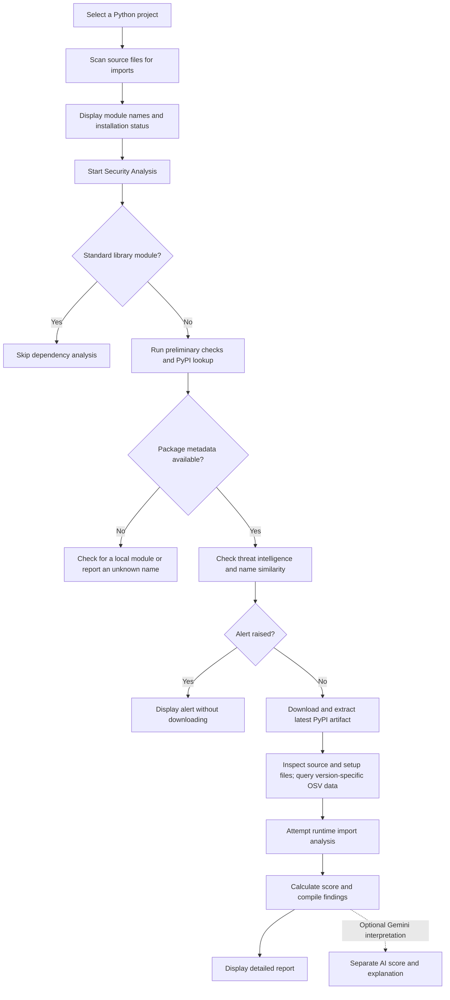

# ChainGuard

**Python Dependency Security Analysis · Team Project**


[Features](#what-it-does) · [Interface](#interface) · [Getting started](#getting-started) · [Usage](#using-the-application) · [Risk scores](#understanding-the-scores) · [Limitations](#current-limitations)

ChainGuard is a Python desktop application for exploring security risks in a project's imported dependencies. It combines import discovery, PyPI metadata checks, OSV queries, static source inspection, and limited runtime analysis in a Tkinter interface.

Developed as a team project for COMP 461 — Introduction to Cyber Security at MEF University, ChainGuard is an educational prototype for investigating software supply chain security. Its findings and scores are indicators for review, not proof that a package is malicious or safe.

## Why ChainGuard?

A Python project's dependencies introduce code maintained outside the project itself. Reviewing those dependencies can involve several separate questions: does a package name look unexpected, are there relevant security advisories, and does the source contain behavior that deserves closer inspection?

ChainGuard was built to explore these questions through a single desktop workflow. The team project brings together dependency discovery, advisory lookups, source analysis, and experimental runtime checks so that users can inspect the evidence behind a warning. Its purpose is to support investigation and learning about software supply chain risks.

## Interface

The desktop interface brings project selection, scan progress, package results, and analysis logs into one window. Package rows provide access to detailed findings.


*Example interface screenshot. Displayed scores and classifications illustrate the UI; they are not independently validated verdicts about the packages shown.*

## What it does

- **Discovers imports:** Recursively scans Python files, extracts top-level module names using AST parsing and regular expressions, and displays installation status and available version information. Common virtual environment, Git, and bytecode cache directories are excluded.
- **Checks package metadata:** Queries PyPI for package information and yanked release records, and uses name-similarity rules to flag possible typosquatting.
- **Queries OSV:** Looks for package-level advisory text containing suspicious indicators and, during full analysis, queries vulnerabilities for the version being inspected.
- **Inspects source code:** Applies basic taint tracking to selected input sources and dangerous calls, including `eval`, `exec`, and subprocess operations. Additional rules look for domain and IP references, credential-like strings, obfuscation patterns, and suspicious setup behavior in `setup.py` and `pyproject.toml`.
- **Attempts runtime analysis:** Imports the downloaded package in Docker when the Docker command is detected, or uses a monitored local subprocess when Docker is unavailable and `psutil` is installed.
- **Displays findings:** Shows package status, risk scores, logs, and detailed reports with categorized findings and available file and line references.
- **Offers optional AI interpretation:** Can send package logs and an analysis summary to Gemini for a separate AI score and explanation.

## Project files

The application files are stored under `ChainGuard-main/`:

```text
ChainGuard-main/
├── requirements.txt
└── src/
    ├── app.py
    └── chain_guard.py
```

`src/chain_guard.py` contains the interface and analysis components. `src/app.py` is an import-discovery example. `requirements.txt` lists dependencies used by that example, not the scanner's own installation requirements.

## Getting started

Use Python 3.10 or later with Tkinter available. The code uses `sys.stdlib_module_names`, which requires Python 3.10 or later. Internet access is needed for PyPI downloads and OSV checks.

Clone the repository and enter the source directory:

```bash
git clone https://github.com/berkm00n/ChainGuard.git
cd ChainGuard/ChainGuard-main/src
```

If you already have the repository locally, open `ChainGuard-main/src` instead. Create and activate a virtual environment:

```bash
python -m venv .venv
```

On macOS or Linux:

```bash
source .venv/bin/activate
```

On Windows PowerShell:

```powershell
.venv\Scripts\Activate.ps1
```

Check that Tkinter is available, then start the application:

```bash
python -m tkinter
python chain_guard.py
```

The scanner's core imports use the Python standard library. Optional packages enable additional behavior:

```bash
python -m pip install psutil
python -m pip install google-generativeai
```

`psutil` enables local subprocess monitoring. `google-generativeai` enables the existing Gemini integration, which also requires a working API key and access to a model supported by the code. Neither integration's availability is guaranteed by this repository.

The Docker path uses `python:3.11-slim`. Docker must be installed and running, and the host must support the requested container options. The application's Docker availability check only runs `docker --version`; it does not verify that the daemon, image, or security settings will work.

## Using the application

1. Click **Select Project** and choose the folder containing the Python project to inspect.
2. Click **Scan** to discover imports and populate the package table.
3. Review the discovered names and installation status.
4. Click **Security Analysis** to run metadata checks and, where applicable, download and analyze packages.
5. Double-click a package row to view its detailed report.

For an import-discovery example, copy `ChainGuard-main/src/app.py` into a separate folder, select that folder, and click **Scan**. You do not need to install its requirements or execute `app.py` to discover the imports. Selecting the repository's entire `src` folder would also scan the scanner's own imports.

**Security Analysis can execute downloaded code.** The Docker path requests network isolation, a read-only filesystem, a non-root user, resource limits, and a custom seccomp profile. The fallback runs a subprocess on the host with the current user's permissions; a temporary working directory does not provide security isolation. Use a disposable analysis environment for untrusted packages.

## How analysis proceeds

The scanner discovers dependencies from source imports. Standard library modules are skipped during security analysis. For other names, it looks up PyPI metadata and applies preliminary checks. If a name cannot be resolved through PyPI, it checks for a local module and may display a typo suggestion or an unknown status.

A threat-intelligence alert can stop analysis before download and assign a fixed score of 95. Otherwise, the scanner downloads an artifact for the latest version reported by PyPI, preferring a wheel and falling back to a `.tar.gz` source distribution. It extracts the artifact, performs static checks, and attempts an import for runtime analysis.

This workflow does not resolve a project's complete dependency graph or honor pinned requirements and lockfiles. The inspected version can differ from the version installed in the project. Import names are also not reliably mapped to distribution names, such as `PIL` to `Pillow` or `yaml` to `PyYAML`.

### Analysis workflow



The diagram summarizes the main successful paths. Download, extraction, API, or runtime failures can prevent a package from receiving a complete analysis; check the logs alongside the result table.

## Understanding the scores

For packages that reach the full analyzer, the implemented stage limits are:

| Stage | Maximum points |
| --- | ---: |
| Threat intelligence | 25 |
| Static analysis | 50 |
| Setup behavior | 10 |
| Dynamic analysis | 20 |

Stage scores are added and capped at 100. Their individual limits sum to 105; the implementation does not proportionally normalize them.

In the current GUI workflow, threat intelligence is checked before full analysis. Flagged packages take the early alert path; the full analyzer is called without a threat-intelligence callback, so its threat-intelligence stage remains zero in that path.

| Full-analysis score | Risk level | GUI security label |
| --- | --- | --- |
| 0–9 | Very Low | SAFE |
| 10–29 | Low | SAFE |
| 30–49 | Medium | WARNING |
| 50–69 | High | SUSPICIOUS |
| 70–100 | Critical | MALICIOUS |

These labels reflect heuristic rules. For example, the code can flag a package based on at least three yanked artifact records across its release history, security-related yanking reasons, or name similarity. Such signals do not independently establish malicious intent. A zero score can also appear for an unresolved package, so read the status and findings together.

The optional Gemini score is separate from the rule-based score.

## Optional Gemini configuration

The application reads credentials in this order:

1. `GOOGLE_API_KEY`
2. `GEMINI_API_KEY`
3. `google_api_key` or `gemini_api_key` in an optional, locally created `config.json` in the current working directory

For example, set a key in the terminal before launching the application:

On macOS or Linux:

```bash
export GEMINI_API_KEY="your-api-key-here"
python chain_guard.py
```

On Windows PowerShell:

```powershell
$env:GEMINI_API_KEY="your-api-key-here"
python chain_guard.py
```

Keep credentials private and use your own key. When enabled, the integration sends package logs and an analysis summary to the external service; logs may contain finding details. The core analysis can run without Gemini.

## Current limitations

- **Heuristic coverage:** Taint tracking is limited to selected syntax patterns and simple variable propagation. It is not a complete interprocedural analysis, and pattern matches can produce false positives or miss harmful behavior.
- **Limited runtime observations:** The Docker path examines process output for keywords rather than tracing system calls. The local fallback samples CPU, memory, connections, open files, and child processes during a short observation period. An import failure or quiet execution does not establish safety.
- **Incomplete feed configuration:** The code includes parsers for community malicious-package lists, but the only configured source is the PyPI simple index, which those parsers do not handle. The supplied configuration therefore does not provide a working community blacklist feed.
- **External service dependence:** Failed API requests or downloads can leave analysis incomplete. There are no direct NVD or GitHub Security Advisory API integrations in the supplied code.
- **Python and GUI scope:** The implementation targets Python source and imported packages. It does not provide binary analysis, other package ecosystems, a scanning CLI, CI/CD integration, or report export.

## Evaluation status

The included example files support demonstrations, but they are not an automated test suite or a reproducible benchmark with pinned package versions. Detection accuracy and performance have not been established through a reproducible benchmark. Findings should be reviewed individually, taking package versions and analysis limitations into account.

## Code organization

The main implementation is contained in `src/chain_guard.py`:

| Component | Responsibility |
| --- | --- |
| `DataFlowAnalyzer` | Visits AST nodes and tracks selected input sources, assignments, and dangerous calls. |
| `AdvancedSecurityAnalyzer` | Coordinates source checks, vulnerability queries, setup inspection, runtime analysis, and risk scoring. |
| `DynamicAnalyzer` | Selects the Docker or local subprocess path and collects the available runtime indicators. |
| `GeminiAIAnalyzer` | Requests an optional AI explanation and score from package logs and an analysis summary. |
| `ChainGuardApp` | Manages the Tkinter interface, import discovery, package retrieval, preliminary checks, and report display. |

## Contributing

Contributions that improve correctness, reproducibility, and usability are welcome. Useful areas include matching imported modules to distributions, inspecting the project's actual dependency versions, refining classification rules, and adding reproducible tests.

To propose a change, fork the repository, create a branch, and open a pull request describing the problem, the change, and how it was checked. For changes to detection rules, include a small reproducible example and explain the expected finding.

## Further reading

These research papers provide background on software supply chain attacks and package analysis:

- [Backstabber's Knife Collection: A Review of Open Source Software Supply Chain Attacks](https://arxiv.org/abs/2005.09535)
- [Towards Measuring Supply Chain Attacks on Package Managers for Interpreted Languages](https://arxiv.org/abs/2002.01139)
